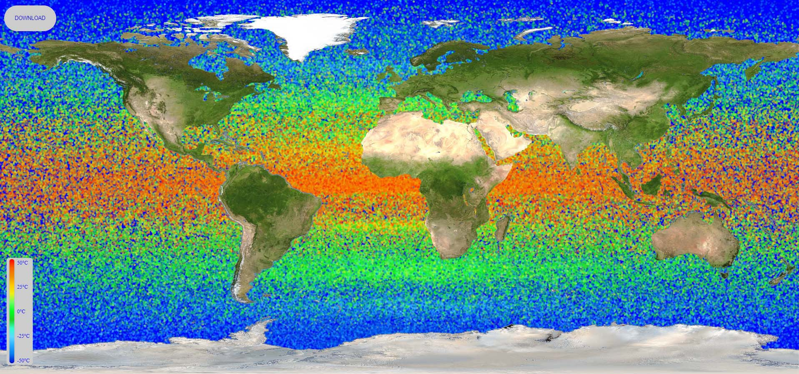

<div align="center">
  <h1>Water Heatmap</h1>
</div>

<div align="justify">

   This repository contains the source code for an application that generates heatmaps based on temperature data. The application is built using **Node.js** and utilizes various libraries such as **Canvas**, **Chai**, **Express**, **html2canvas**, **Mocha**, and **Path**.

   The main functionality of the application is the generate heatmaps by processing temperature data from JSON files. It uses a predefined set of gradient colors to represent different temperature ranges. The generated heatmaps are saved as PNG images and can be accessed through a web server built with **Express**.

   The application supports multiple scenarios for generating heatmaps. It can generate heatmaps based on the current date or specific dates by searching for corresponding data files. It also provides fallback options to handle missing data files.

   The codebase includes unit tests written with **Mocha** and **Chai** to ensure the correctness of the heatmap generation process. The tests cover various scenarios and verify the existence and integrity of the generated heatmaps.

   This application serves as a helpful tool for visualizing temperature data in the form of heatmaps, allowing users to gain insights and analyze temperature patterns effectively.

   <br>


</div>

<p align="center">
  
  <br>
</p>

<br>

<div align="center">

   # Settings

</div>

<div align="left">

1. Clone this repository

```
   git clone https://github.com/lazycatcoder/WaterHeatmap.git
```


2. Install **Node.js**
   
**Node.js** and **npm** (Node Package Manager) should be installed on your system. You can download them from the official Node.js website: *https://nodejs.org*


3. Install Dependencies

Open a terminal or command prompt. Navigate to the extracted/cloned repository folder. Run the following command to install the required dependencies listed in the **package.json** file:

```
   npm install express
   npm install path
   npm install canvas
   npm install html2canvas
   npm install mocha
   npm install chai
```

4. Start the Server 🚀

In the same terminal or command prompt, navigate to the repository folder.
Run the following command to start the server:

```
   node server.js
```
The server should now be running and listening for requests on the specified port *(default is port 3000)*.

5. Access the Application

Open a web browser. In the address bar, enter *http://localhost:3000*

</div>

<br>

<div align="center">

   ## 📝 Additional Information

</div>

<div align="justify">

For the application to work correctly before starting the server, in the JSON folder *('..\WaterHeatmap\json')* in the **compressed_YYYY-MM-DD.json** file, replace YYYY-MM-DD with the current year, month and day.

<br>

🔴 During the development of the application, emphasis was placed on the fact that the data with which the heat map is generated will come in JSON format. It is important to note that in this project the JSON files are not actual, but exemplary and contain an artificially created array with thermal labels, which are represented as coordinates and temperature indicators (x, y, value).

</div>